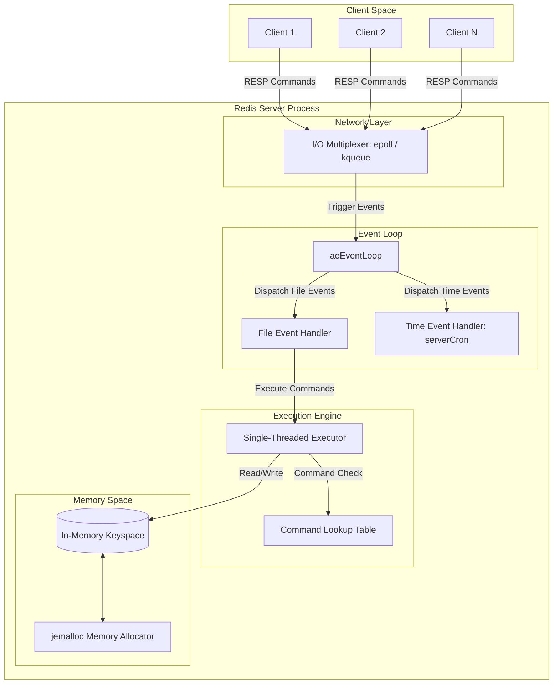
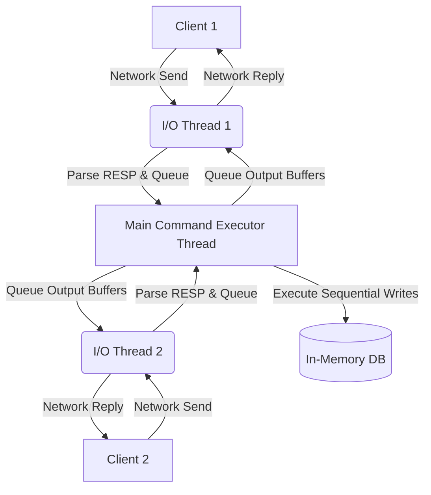
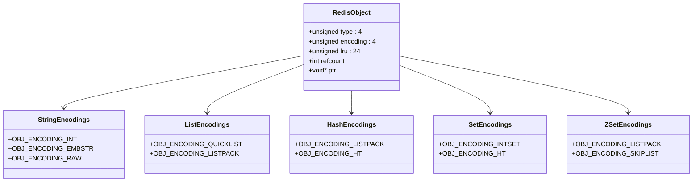
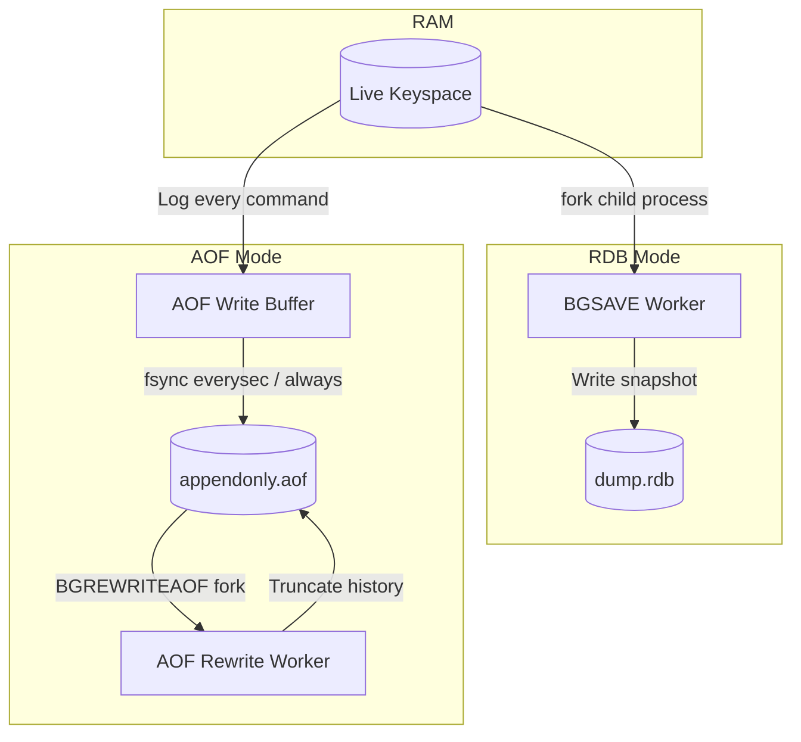
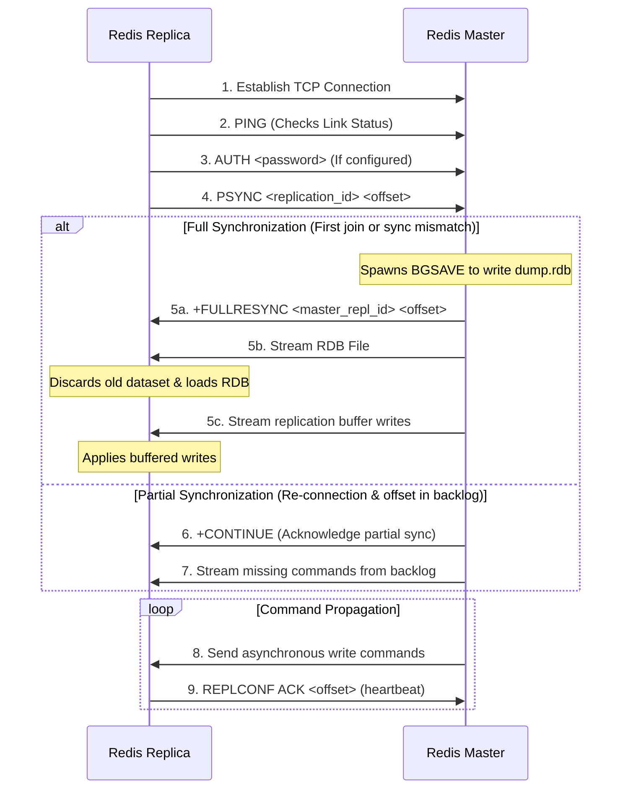
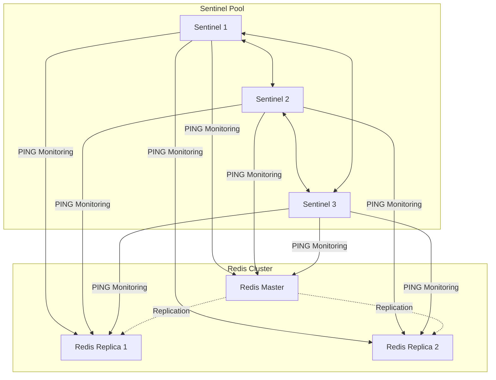
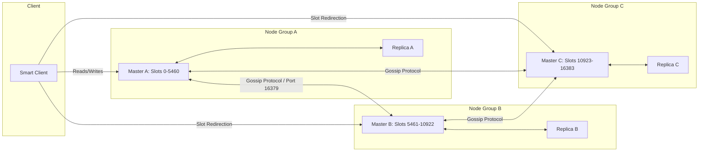
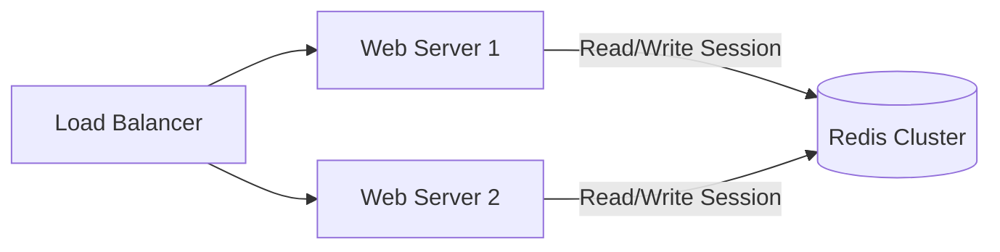
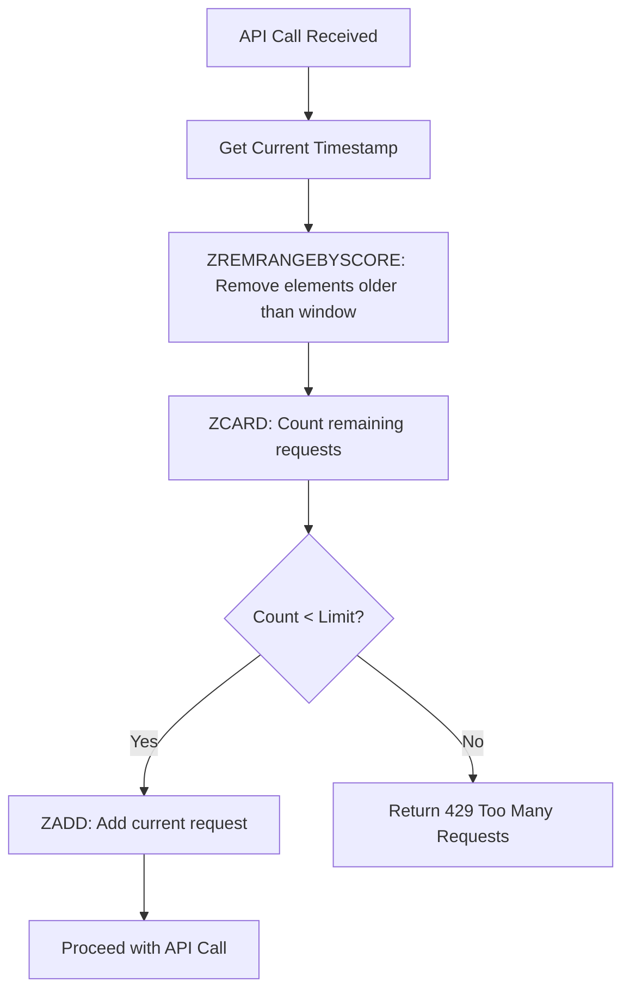

# Chapter 1: Redis Architecture

## 1. What is Redis?

### Definition
**Redis** (which stands for **REmote DIctionary Server**) is an open-source, in-memory, key-value data structure store. It is written in ANSI C and is widely utilized as a database, cache, message broker, and streaming engine. Unlike traditional relational database management systems (RDBMS) that store data on disk, Redis keeps all data in the host system's Random Access Memory (RAM). This architectural decision allows read and write operations to execute with sub-millisecond latencies, making it the de facto standard for high-performance, real-time application caching and data handling.

Redis is often referred to as a **data structure server**. This is because keys can map to a variety of complex data structures such as Strings, Lists, Hashes, Sets, Sorted Sets, Bitmaps, HyperLogLogs, Geospatial indexes, and Streams.

### History
Redis was created in **2009** by **Salvatore Sanfilippo** (known online as *antirez*). At the time, Sanfilippo was building **LLOOGG**, a real-time web analytics service. As the traffic to LLOOGG grew, he found that traditional relational databases (specifically MySQL) could not keep up with the write load of tracking incoming page views in real-time. The disk I/O bottlenecks and transaction overhead of MySQL meant that scaling required expensive hardware upgrades or complex horizontal sharding.

To solve this specific performance bottleneck, Sanfilippo wrote the first prototype of Redis in C. He designed it to run entirely in memory, support atomic increments, and offer dynamic lists that could be manipulated directly on the server without needing to read the entire data payload into the application memory. He open-sourced the project on GitHub, where it quickly gained traction among developers facing similar real-time data ingestion challenges.

### Why Redis Was Created
Before Redis, the primary in-memory caching solution was **Memcached**. While Memcached was highly efficient at storing simple string key-value pairs, it had severe limitations:
1. **Lack of Data Structures**: Memcached only supported strings. If a developer wanted to append an item to an array stored in the cache, they had to fetch the serialized array over the network, deserialize it in their application, append the item, serialize it back, and write it back to Memcached. This created massive network overhead and CPU serialization costs.
2. **No Native Persistence**: Memcached was strictly transient. If a server restarted, all cached data was permanently lost.
3. **No Replication**: Memcached did not natively support replication, making high-availability setups complex to orchestrate.

Redis was created to address these deficiencies by offering:
* **Rich Data Types**: Performing operations (like list pushes, set intersections, or sorted set range queries) directly in memory on the server side.
* **Tunable Persistence**: Allowing data to be written to disk asynchronously while still serving requests from memory.
* **Built-in Replication and HA**: Enabling master-replica synchronization, automatic failover (via Sentinel), and horizontal clustering.

---

## 2. Redis Core Concepts

To understand the architecture of Redis, one must first grasp its four foundational pillars:

### In-Memory Database
Redis holds all its data in the host machine’s primary memory (RAM). When an application requests a key, Redis reads it directly from memory addresses, eliminating the physical seek times associated with Solid State Drives (SSDs) or Hard Disk Drives (HDDs). 

| Operation | Typical Latency |
| :--- | :--- |
| RAM Access | ~50 - 100 nanoseconds |
| NVMe SSD Access | ~10 - 100 microseconds (100x slower than RAM) |
| SATA SSD Access | ~50 - 150 microseconds |
| Spinning Disk (HDD) | ~5 - 15 milliseconds (100,000x slower than RAM) |

By operating entirely within RAM, Redis can comfortably process over **100,000 read/write operations per second (QPS)** on a single standard CPU core, with sub-millisecond latency.

### Key-Value Store
Redis operates as a giant associative array (or dictionary). Every piece of data is associated with a unique **Key**.
* **Keys**: Binary-safe, meaning a key can be any binary sequence. This includes plain text strings (like `"user:1000:profile"`), serialized JSON, or raw binary data such as a JPEG image file up to 512 MB in size.
* **Values**: Instead of restricting values to simple strings, Redis allows values to be complex data structures, managed by specialized in-memory engines.

### Data Structures
Redis is not merely a key-value store; it is a **data structure server**. Rather than forcing the client to retrieve, parse, and rewrite values, Redis exposes commands that allow operations to be executed *directly* on the server. For example:
* Adding an element to a set: `SADD user:1000:tags "developer"`
* Incrementing a counter: `INCR page_views`
* Truncating a list: `LTRIM log_queue 0 99`

These operations are performed atomically, preventing race conditions that occur when multiple application servers attempt to modify the same resource simultaneously.

### Persistence
Although RAM provides speed, it is volatile; if power is cut or the server crashes, the data disappears. Redis addresses this vulnerability through optional, configurable persistence layers:
1. **RDB (Redis Database)**: Point-in-time, binary snapshots of the dataset written to disk at specified intervals.
2. **AOF (Append-Only File)**: A log that records every write command received by the server. The log is replayed on startup to reconstruct the original dataset.
3. **Hybrid Mode**: A combination of RDB and AOF, which uses RDB snapshots for rapid boots and AOF logs for point-in-time durability.

---

## 3. Redis Internal Architecture

Understanding what happens inside the single-threaded `redis-server` process requires examining the event-driven system, network layers, and memory allocator.



### Redis Server
The `redis-server` is a daemon process that initializes the keyspace, spins up the event loop, binds to a configured network port (default: `6379`), and listens for incoming connections. At its core, the server maintains an internal state struct (`struct redisServer`) containing pointers to the active databases, client lists, replication backlog, cluster configuration, and system statistics.

### Event Loop
The heart of Redis's performance is its custom, lightweight event loop, known as the **AE library** (`ae.c`). Redis does not allocate a thread-per-client connection. Instead, it utilizes **I/O Multiplexing** to monitor thousands of client sockets simultaneously.

The AE library wraps the operating system’s most efficient multiplexing system calls:
* **`epoll`** on Linux
* **`kqueue`** on macOS and BSD
* **`evport`** on Solaris
* **`select`** / **`poll`** as a fallback for compatibility

#### File Events vs. Time Events
The event loop processes two distinct categories of events:
1. **File Events**: Triggered when a socket has data ready to be read (client request) or is ready to accept written data (sending response back to client), or when a new client connection is established.
2. **Time Events**: Scheduled tasks that run periodically inside the server. These are orchestrated by a function called `serverCron` (which runs at a frequency defined by the `hz` configuration, typically 10 to 100 times per second). `serverCron` performs:
   * Active key expiration (reclaiming memory from expired TTLs).
   * Eviction checking (applying `maxmemory` policies).
   * Active memory defragmentation.
   * Master-replica heartbeat propagation.
   * AOF rewrite and RDB snapshot checkpoints.

### Single-Threaded Model
A common point of confusion is how a database execution engine can be "single-threaded" yet outperform multi-threaded databases.

#### Why Single-Threaded?
1. **No Lock Contention**: Multi-threaded systems require locks (mutexes, semaphores, read-write locks) to coordinate thread access to shared data structures. Lock contention introduces substantial CPU overhead and can lead to deadlocks. In Redis, since only one thread accesses the keyspace, no locks are required.
2. **No Context Switching**: Switching between CPU threads requires saving registers, updating page tables, and invalidating CPU caches. A single-threaded process avoids this overhead entirely.
3. **CPU Cache Optimization**: Modern CPU architectures rely heavily on L1, L2, and L3 caches. Single-threaded execution ensures that data remains hot in the core's cache, avoiding cache-line bouncing.
4. **Hardware Bottlenecks**: Redis is almost always bound by **network bandwidth** or **memory throughput**, rather than CPU processing power.

#### Multi-Threading in Modern Redis (Redis 6.0+)
While the **command execution engine** remains strictly single-threaded, Redis has introduced multi-threaded support for background I/O tasks:
* **Lazy Freeing**: Background threads handle the deallocation of memory for large data structures (using the `UNLINK` command instead of `DEL`) to prevent the main thread from blocking.
* **Threaded I/O**: Under high network load, the main thread can bottleneck on reading and parsing commands from network sockets, or writing responses back. Redis 6.0+ allows spawning auxiliary I/O threads to delegate socket read/write operations and RESP protocol serialization/deserialization. The actual command execution, however, is still funneled back to the main thread sequentially.



### Network Layer
Redis communicates over TCP using the **RESP (Redis Serialization Protocol)**. RESP is a human-readable, binary-safe protocol designed to be parsed quickly with minimal CPU overhead.

#### RESP Protocol Structure
Every command sent to Redis is formatted as an Array of Bulk Strings. For example, the command `SET mykey "hello"` is transmitted over the wire as:

```text
*3\r\n
$3\r\n
SET\r\n
$5\r\n
mykey\r\n
$5\r\n
hello\r\n
```

Here is a breakdown of the RESP protocol symbols:
* `*` denotes an **Array**. `*3` means an array of 3 elements.
* `$` denotes a **Bulk String**. `$3` means the next element is 3 bytes long.
* `\r\n` (CRLF) acts as the delimiter.
* `+` denotes a **Simple String** (e.g., `+OK\r\n`).
* `-` denotes an **Error** (e.g., `-ERR index out of range\r\n`).
* `:` denotes an **Integer** (e.g., `:1000\r\n`).

### Command Execution Engine
When a client sends a query:
1. The read event is caught by the OS multiplexer (e.g., `epoll`).
2. The network buffer is read into a client query buffer.
3. The parser processes the RESP query array.
4. The execution engine queries the **Command Table** (a lookup hash table containing structures like `struct redisCommand`).
5. Checks are performed: authentication status, memory constraints, clustering redirection (`MOVED`/`ASK`), and command arity.
6. The command handler is invoked. The handler executes in-memory operations on the database.
7. The result is formatted into RESP and written to the client's output buffer (or replication buffer).
8. The file event handler registers a write event, and the output buffer is flushed to the network socket when it becomes writable.

### Memory Management
Redis manages memory explicitly using an external memory allocator rather than the operating system’s default `glibc malloc` (which has a high fragmentation rate under erratic workloads).

#### jemalloc
By default on Linux systems, Redis compiles with **`jemalloc`**.
* `jemalloc` groups memory allocations into distinct "size classes" (e.g., 8 bytes, 16 bytes, 32 bytes, etc.).
* When a key is deleted, the memory block is returned to `jemalloc`'s internal pools rather than immediately returning it to the OS kernel. Consequently, the operating system's RSS (Resident Set Size) metric may remain higher than the actual memory used by Redis keys.

#### Memory Fragmentation Ratio
The fragmentation ratio is calculated as:

$$\text{Fragmentation Ratio} = \frac{\text{Used Memory RSS}}{\text{Used Memory (Dataset Size)}}$$

* A ratio **between 1.0 and 1.5** is normal and healthy.
* A ratio **greater than 1.5** indicates high memory fragmentation, meaning the OS allocated memory but Redis has released the data, leaving pockets of unused, trapped memory.
* A ratio **less than 1.0** indicates that the system has run out of physical RAM and has started swapping memory pages to the disk, which degrades performance by orders of magnitude.

#### Active Defragmentation
Redis supports active defragmentation (`activedefrag yes`). When enabled, the `serverCron` periodically scans the keyspace, identifies fragmented memory pages, allocates new contiguous memory locations for the keys, copies the data over, and frees the old fragmented addresses.

---

## 4. Redis Data Structures

Redis exposes several rich data structures. Under the hood, each logical structure can be encoded in different internal representations depending on size constraints.



### Strings

#### Internal Implementation
The String is the most basic Redis data type. However, Redis does not use standard null-terminated C strings (`char*`). Instead, it uses a custom abstraction called **SDS (Simple Dynamic String)**.

```c
struct sdshdr8 {
    uint8_t len;         /* Number of bytes currently used */
    uint8_t alloc;       /* Total memory bytes allocated (excluding header & null-byte) */
    unsigned char flags; /* 3 lsb for type, 5 msb unused */
    char buf[];          /* Flex-array containing the string data */
};
```

##### Why SDS?
1. **O(1) Length Retrieval**: Standard C strings require traversing the entire string to find the null terminator `\0` (O(N) complexity). SDS tracks length in the `len` field, making `STRLEN` an O(1) operation.
2. **Binary Safety**: C strings determine termination by the null character `\0`. Thus, they cannot contain binary payloads (like raw images or Protobuf streams) containing `\0`. SDS relies on the `len` header, allowing it to store any binary stream.
3. **Buffer Overflow Prevention**: Before appending to an SDS string via `sdscat`, the function checks if `alloc - len` has enough space. If not, it reallocates memory, avoiding memory corruption risks.
4. **Pre-Allocation & Lazy Freeing**: To minimize memory reallocation syscall overhead, SDS pre-allocates extra space when expanded (e.g., doubling the allocation if the size is under 1MB). When shrunk, the memory is not freed immediately but is marked as available in `alloc`.

##### Encoded Representations of Strings
* **`OBJ_ENCODING_INT`**: Used if the string can be parsed as a 64-bit signed integer. The value is stored directly in the pointer field (`ptr`) of the `robj` structure, saving an extra memory allocation.
* **`OBJ_ENCODING_EMBSTR`**: Used for short strings (up to 44 bytes). The `robj` header and the SDS header are allocated within a single contiguous block of memory. This reduces memory fragmentation and improves CPU cache-line hits.
* **`OBJ_ENCODING_RAW`**: Used for strings larger than 44 bytes. The `robj` header and the SDS header are allocated in separate memory locations.

#### Time Complexity
* `SET` / `GET`: $O(1)$
* `INCR` / `DECR`: $O(1)$
* `APPEND`: $O(1)$ amortized
* `GETRANGE` / `SETRANGE`: $O(N)$ (where $N$ is the length of the range)

#### Use Cases
* **Page Caching**: Storing serialized JSON representations of database entities.
* **Distributed Counters**: Tracking page views or request frequencies via `INCRBY`.
* **Distributed Locks**: Utilizing `SET key value NX PX milliseconds` (atomic SET if Not eXists).

#### Interview Questions
* **Q**: What is the difference between `RAW` and `EMBSTR` encodings in Redis strings?
* **A**: `EMBSTR` allocates the `robj` header and the underlying SDS string header in a single contiguous memory block via one call to `malloc`. `RAW` calls `malloc` twice: once for the `robj` and once for the SDS. Consequently, `EMBSTR` is faster to construct, faster to free, and has better cache locality, but cannot be modified without being converted to `RAW`.

---

### Lists

#### Internal Implementation
Historically, Redis Lists were implemented using doubly-linked lists (`linkedlist`) or compressed ZIP files (`ziplist`). Modern Redis uses **`quicklist`** (and has replaced `ziplist` with **`listpack`**).

* **Quicklist**: A doubly-linked list of listpack nodes.
* **Listpack**: A contiguous block of memory containing sequence elements. Unlike a linked list, which requires front and back pointers (16 bytes of overhead per node on 64-bit systems), a listpack stores elements back-to-back, drastically reducing pointer overhead and optimizing CPU cache line alignment.

```text
[Head Quicklist Node] <---> [Quicklist Node] <---> [Tail Quicklist Node]
        |                           |                          |
   [Listpack]                  [Listpack]                 [Listpack]
 [e1, e2, e3...]              [e4, e5...]                [e6, e7, e8...]
```

#### Time Complexity
* `LPUSH` / `RPUSH` / `LPOP` / `RPOP`: $O(1)$
* `LINDEX` / `LINSERT`: $O(N)$ (where $N$ is the list length)
* `LRANGE`: $O(S + N)$ (where $S$ is start offset and $N$ is number of elements)

#### Use Cases
* **Task Queues**: Producers `LPUSH` tasks, and workers consume them using blocking reads like `BRPOP`.
* **Recent Activity Feeds**: Storing the last 100 actions of a user and truncating the list using `LTRIM`.

#### Interview Questions
* **Q**: Why was `ziplist` replaced by `listpack` in modern Redis?
* **A**: Ziplist was vulnerable to "cascading updates." Each entry in a ziplist stored the length of the previous entry to allow reverse traversal. If an update changed the size of a node such that its length required more bytes to represent, it could force the next node to resize, which in turn could force the subsequent node to resize, cascading down the entire list. `listpack` resolves this by storing the length of the current entry at the end of the entry itself, preventing cascading reallocations.

---

### Hashes

#### Internal Implementation
Redis Hashes map string fields to string values. They are represented internally in two ways:
1. **Listpack**: Used when the hash size is small (configured by `hash-max-listpack-entries`, default 512, and `hash-max-listpack-value`, default 64 bytes). Key-value pairs are stored sequentially as back-to-back entries in a flat memory block.
2. **Dict (Hash Table)**: Used when thresholds are exceeded. It is a standard hash table using MurmurHash2 to compute buckets, resolving collisions via linked-list chaining.

##### Progressive Rehashing
To prevent blocking the event loop when resizing a large hash table, Redis uses progressive rehashing. A dict contains two internal hash tables: `ht[0]` (active) and `ht[1]` (newly allocated table of double the size).
* During every command execution (e.g., `HGET`, `HSET`), Redis moves a small bucket of keys from `ht[0]` to `ht[1]`.
* In addition, the time event handler `serverCron` dedicates up to 1ms per loop iteration to migrate keys.
* Once the migration is complete, the memory of `ht[0]` is freed, and `ht[1]` becomes `ht[0]`.

```mermaid
flowchart LR
    subgraph Dict Structure
        direction TB
        rehashidx[rehashidx: 2]
        
        subgraph ht0[ht[0] - Old Table]
            Bucket0 --> dictEntry1[keyA: valA]
            Bucket1 --> dictEntry2[keyB: valB]
            Bucket2[Bucket 2: Migrated]
            Bucket3[Bucket 3: Migrated]
        end

        subgraph ht1[ht[1] - New Table]
            nBucket0 --> dictEntryC[keyC: valC]
            nBucket2 --> dictEntryD[keyD: valD]
            nBucket3 --> dictEntryE[keyE: valE]
        end
    end
```

#### Time Complexity
* `HSET` / `HGET` / `HEXISTS`: $O(1)$
* `HDEL`: $O(1)$
* `HGETALL`: $O(N)$ (where $N$ is the number of fields in the hash)

#### Use Cases
* **Entity Storage**: Storing database objects like `user:1000` containing keys like `username`, `email`, and `last_login`. This uses significantly less memory than storing individual keys (e.g., `user:1000:username`) due to structural sharing inside the hash table.

#### Interview Questions
* **Q**: Explain how progressive rehashing works. What happens to read requests during this transition?
* **A**: During progressive rehashing, any read operations (`HGET`, `HEXISTS`) look up the key in `ht[0]` first. If it is not found, Redis checks `ht[1]`. Write operations (`HSET`) write directly to `ht[1]`, ensuring that no new elements are added to `ht[0]`, allowing the migration process to move towards completion.

---

### Sets

#### Internal Implementation
Sets represent an unordered collection of unique strings. They are encoded in two ways:
1. **Intset**: Used when all elements in the set are base-10 integers (64-bit signed or lower) and the size is below `set-max-intset-entries` (default 512). The intset is a sorted array of integers. Since it is sorted, searches are executed via binary search ($O(\log N)$).
2. **Dict (Hash Table)**: When the set exceeds configuration thresholds or contains non-integer values, it converts to a standard Redis `dict` where keys are the set members and values are set to `NULL`.

#### Time Complexity
* `SADD` / `SREM` / `SISMEMBER`: $O(1)$
* `SINTER` / `SUNION` / `SDIFF`: $O(N \times M)$ (where $N$ is the cardinality of the smallest set, and $M$ is the number of sets)

#### Use Cases
* **Tagging Systems**: Storing categories or tags for articles (e.g., `article:1020:tags` -> `["programming", "redis", "databases"]`).
* **Unique Item Accumulators**: Storing unique IP addresses that visited a webpage to compute raw unique traffic figures.

#### Interview Questions
* **Q**: What happens when you add a string member (e.g., `"abc"`) to a set currently encoded as an `intset`?
* **A**: Redis will dynamically upgrade the collection from an `intset` to a `dict` (hash table). The integers are converted into string representation, rehashed, and stored as keys in the newly allocated dictionary. This upgrade is irreversible for the lifespan of that set in memory.

---

### Sorted Sets (ZSets)

#### Internal Implementation
Sorted Sets assign a floating-point number called a **Score** to every member, keeping the list sorted.
1. **Listpack**: Used for small datasets (configured by `zset-max-listpack-entries` and `zset-max-listpack-value`). Score-member pairs are kept sequentially, sorted by score.
2. **Skiplist + Dict**: Used for larger datasets.
   * **Skiplist (`zskiplist`)**: An index structure built over a linked list. It uses probabilistic node promotion to create multiple levels of forward links. This allows $O(\log N)$ search, insertion, deletion, and fast range queries (e.g., "get elements with scores between 10 and 20").
   * **Dict**: Maps members to their current scores. This allows $O(1)$ queries to check the score of any specific member (`ZSCORE`).

```text
Level 3: [Head] ------------------------------> [Node 30] ---------------------> NULL
Level 2: [Head] -------------> [Node 15] ----------> [Node 30] ----------> [Node 45] -> NULL
Level 1: [Head] -> [Node 5] -> [Node 15] -> [Node 22] -> [Node 30] -> [Node 38] -> [Node 45] -> NULL
```

#### Time Complexity
* `ZADD` / `ZREM`: $O(\log N)$
* `ZRANGE` / `ZREVRANGE`: $O(\log N + M)$ (where $M$ is the number of returned elements)
* `ZSCORE`: $O(1)$ (retrieved from the internal dictionary)

#### Use Cases
* **Real-time Leaderboards**: Dynamic high-score tracking where players are sorted in real time.
* **Sliding Window Rate Limiter**: Storing timestamps of client API calls as scores and trimming elements older than the current window.

#### Interview Questions
* **Q**: Why did Redis use a SkipList instead of a Self-Balancing Binary Search Tree (like a Red-Black Tree) for Sorted Sets?
* **A**: SkipLists are easier to implement and maintain than Red-Black trees, particularly for concurrency and range-query tasks. Range queries (e.g., `ZRANGEBYSCORE`) only require finding the starting node via the higher levels, and then traversing the bottom-level pointers sequentially. Furthermore, inserting a node in a SkipList only requires local pointer updates, whereas Red-Black trees require complex global rebalancing rotations.

---

### Bitmaps

#### Internal Implementation
Bitmaps are not a distinct data type. Rather, they are String objects manipulated using bitwise commands. Because strings are binary-safe Simple Dynamic Strings (SDS), they can be viewed as an array of bits.

#### Time Complexity
* `SETBIT` / `GETBIT`: $O(1)$
* `BITCOUNT`: $O(N)$ (where $N$ is the number of bytes in the string)
* `BITOP` (AND, OR, XOR, NOT): $O(N)$

#### Use Cases
* **Daily Active Users (DAU)**: A bitmap where each bit index represents a `user_id`. When user 1024 logs in on 2026-06-14, set bit 1024: `SETBIT active_users:2026-06-14 1024 1`. Cardinality is counted via `BITCOUNT`.
* **Feature Flagging**: Fast Boolean flag arrays for systems containing millions of users.

#### Interview Questions
* **Q**: What is a potential pitfall of using `SETBIT` with a very high index, such as `SETBIT mykey 4000000000 1`?
* **A**: Redis must allocate memory for all preceding bits. A bit index of 4 billion equates to a memory allocation of approximately 500 MB ($4 \times 10^9 / 8$ bytes) of contiguous RAM. This large allocation will block the single-threaded execution thread, causing application latency spikes.

---

### HyperLogLog (HLL)

#### Internal Implementation
HyperLogLog is a probabilistic data structure used to estimate the cardinality (unique count) of a set.
* Traditional sets grow in memory proportionally to the number of elements.
* HyperLogLog uses a mathematical approximation based on hashing: it hashes each element and observes the number of leading zeros in the hash's binary representation.
* Standard Redis HyperLogLogs use **12 KB** of memory, providing a cardinality estimate up to $2^{64}$ items with a standard error of **0.81%**.

#### Time Complexity
* `PFADD`: $O(1)$
* `PFCOUNT`: $O(1)$

#### Use Cases
* **Unique Pageviews (UV)**: Tracking unique users visiting a webpage without storing their user IDs or cookies.
* **Search Query Cardinality**: Estimating the number of unique search terms entered into a portal daily.

#### Interview Questions
* **Q**: Explain how HyperLogLog achieves cardinality estimation in just 12 KB.
* **A**: Redis allocates 16,384 ($2^{14}$) registers, each 6 bits in size. The hash of an element uses the first 14 bits to select a register, and the remaining bits to find the position of the leftmost 1-bit. A higher number of leading zeros indicates a larger estimated cardinality. 16,384 registers $\times$ 6 bits = 98,304 bits = 12 KB of memory.

---

### Streams

#### Internal Implementation
Introduced in Redis 5.0, Streams act as an append-only log. Under the hood, Streams are implemented using a hybrid data structure:
* **Radix Tree (Rax)**: A space-optimized trie structure. Keys in the radix tree are stream IDs (timestamps plus sequence numbers, e.g., `1672531199000-0`).
* **Listpacks**: Raw stream payloads are packed together inside listpacks at the radix tree nodes to reduce overhead and improve read localization.

```text
                   [ Radix Tree Root ]
                      /          \
            [Prefix: 1672]     [Prefix: 1673]
                 /                     \
      [Node: 531199000]           [Node: 121000000]
             |                            |
       [ Listpack ]                 [ Listpack ]
    [ ID-0: k1=v1... ]           [ ID-0: k2=v2... ]
    [ ID-1: k3=v3... ]           [ ID-1: k4=v4... ]
```

#### Time Complexity
* `XADD`: $O(\log N)$
* `XREAD` / `XREADGROUP`: $O(\log N + M)$ (where $M$ is the number of elements returned)

#### Use Cases
* **Message Brokering**: Decoupling microservices with consumer groups (`XGROUPCREATE`), where multiple workers share a queue, acknowledge items (`XACK`), and track pending messages.
* **Audit Logs**: Storing immutable sequences of transactional events.

#### Interview Questions
* **Q**: What is the primary operational difference between Redis Pub/Sub and Redis Streams?
* **A**: Redis Pub/Sub is "fire-and-forget"—if a subscriber is offline when a message is published, they lose it forever. Redis Streams are persistent on disk (via standard persistence mechanisms) and track offsets, allowing consumers to pull historical data or catch up after a disconnection.

---

## 5. Redis Persistence

Redis provides two primary persistence mechanisms, which can be used individually or combined.



### RDB (Redis Database) Snapshots
RDB persistence performs point-in-time snapshots of the dataset at specified intervals (e.g., "if 10,000 keys changed in 60 seconds").

#### The Forking Process
1. The server calls the system level `fork()` function.
2. A child process is spawned, which inherits an exact clone of the parent's memory layout.
3. The child writes the dataset to a temporary RDB file.
4. Once written, the temporary file replaces the old `dump.rdb` file atomically.

#### Copy-On-Write (COW)
When `fork()` is executed, the OS does not copy the physical memory pages. Instead, it points the child process’s page tables to the parent’s physical RAM addresses, marking them as read-only.
* If a client sends a write request, the main Redis thread catches the write violation.
* The OS copies that specific page (typically 4 KB) to a new memory address, updates the parent’s page table, and then performs the write operation.
* The child process’s page tables still point to the original, unmodified page, allowing it to write a consistent snapshot of the database at the moment of the fork.

> [!WARNING]
> **Disable Transparent Huge Pages (THP):**
> Modern Linux kernels use THP to automatically allocate 2 MB memory pages instead of 4 KB pages. During a Redis `fork()`, if THP is active, any small write command will force the OS to copy a full 2 MB page rather than 4 KB. This dramatically increases memory usage during snapshots and can lead to out-of-memory (OOM) crashes.

#### Advantages & Disadvantages of RDB
* **Advantages**:
  * **Compact Storage**: RDB is a highly compressed single file, making it ideal for backups and disaster recovery.
  * **Fast Boot Times**: Restoring a database from an RDB file is much faster than replaying AOF logs command-by-command.
* **Disadvantages**:
  * **Data Loss Vulnerability**: If the server crashes between snapshots, all writes since the last snapshot are lost.
  * **CPU Overhead**: Spawning a child process via `fork()` is CPU-heavy on large datasets and can freeze client processing for several milliseconds if the dataset is tens of gigabytes in size.

---

### AOF (Append-Only File)
AOF logs every write command received by Redis to an append-only file on disk.

#### AOF Sync Policies
Commands are written to an internal AOF buffer before being flushed to disk. The frequency of flushing is managed by the `appendfsync` parameter:
1. **`appendfsync always`**: The buffer is flushed to disk after *every* write command. This is highly secure but limits throughput to the disk's physical write speeds.
2. **`appendfsync everysec`** (Default): The buffer is flushed once per second by a background thread. This balances performance with durability, risking at most 1 second of data loss.
3. **`appendfsync no`**: The OS decides when to flush the buffer (usually every 30 seconds). This is the fastest setting but provides the lowest durability.

#### AOF Rewrite
Over time, the AOF file grows as commands accumulate. For example, if a counter is incremented 1 million times, the AOF file will contain 1 million `INCR` lines.

To keep the file size manageable, Redis implements **AOF Rewriting** (`BGREWRITEAOF`):
1. A child process is spawned via `fork()`.
2. The child reads the current in-memory dataset and writes the minimum command sequence required to reconstruct it (e.g., writing a single `SET counter 1000000` instead of 1 million increments).
3. The parent continues appending incoming client commands to the active AOF file on disk and also buffers them in an internal "AOF Rewrite Buffer".
4. When the child finishes writing, the parent appends the buffered commands to the new file and replaces the old AOF file atomically.

---

### Hybrid Persistence
Introduced in Redis 4.0, Hybrid Persistence combines the strengths of RDB and AOF. When enabled via `aof-use-rdb-preamble yes`, the AOF rewrite process writes an RDB snapshot to the beginning of the file, then appends incremental write logs to the end. On startup, Redis loads the RDB preamble quickly, then replays the short list of AOF commands.

---

## 6. Redis Replication

Replication allows data from one master server to be copied to multiple replica servers. This provides high availability and read scalability.



### Replication Workflow
1. **Connection**: The replica establishes a connection to the master.
2. **Handshake**: The replica sends a `PING` command to verify connection quality and authenticates if required.
3. **Synchronization Request**: The replica sends the `PSYNC` command along with the master’s run ID (`replication_id`) and the last processed replication offset.

#### Full Synchronization
If the replica is connecting for the first time, or if its replication offset is no longer present in the master's buffer, a full sync is triggered:
* The master executes a background `BGSAVE` to generate an RDB file.
* While the snapshot is being generated, the master buffers all new write commands in its replication buffer.
* Once the RDB file is generated, the master streams it over the network to the replica.
* The replica discards its old dataset, loads the new RDB file, and then applies the buffered writes sent by the master.

#### Partial Synchronization
If a replica disconnects briefly, it sends its last replication offset during reconnection:
* The master maintains a circular **Replication Backlog Buffer** in memory.
* If the replica's offset is still within this backlog, the master sends only the missing data.
* This avoids the need to write and transfer a full RDB file.

### Read Scaling
By configuration, replicas are read-only (`replica-read-only yes`).
* **Scaling**: Applications can route write traffic to the master and distribute read queries across multiple replicas.
* **Consistency Considerations**: Redis replication is **asynchronous**. Replicas acknowledge received commands after they have been processed, which means read queries directed to replicas can return slightly stale data.

---

## 7. Redis Sentinel

While replication provides data redundancy, it does not provide automatic failover. If the master server crashes, a replica must be manually promoted to master. **Redis Sentinel** solves this problem by automating monitoring, notifications, and failover.



### Why Sentinel Exists
Sentinel is a distributed system designed to manage a Redis deployment through three core tasks:
1. **Monitoring**: Periodically checking if the master and replicas are working as expected.
2. **Notification**: Informing system administrators or clients via an API when a monitored instance fails.
3. **Automatic Failover**: Promoting a replica to master if the master goes down, and updating the other replicas to follow the new master.

### Failover Process

#### Subjectively Down (SDOWN)
A Sentinel marks a master as SDOWN if it does not receive a valid response to a `PING` command within the configured `down-after-milliseconds` window. This is a local decision made by a single Sentinel.

#### Objectively Down (ODOWN)
Once a Sentinel marks a master as SDOWN, it queries the other Sentinels in the network.
* If the number of Sentinels reporting the master as down reaches the configured **Quorum** threshold, the master's status is upgraded to ODOWN.
* Quorum is configured on startup (e.g., if there are 3 Sentinels, quorum is typically set to 2).

### Election Mechanism
Once a master is marked as ODOWN, the Sentinels initiate a vote to elect a leader Sentinel to manage the failover:
1. The election uses a consensus protocol similar to Raft.
2. The Sentinel that first detects ODOWN requests votes from the others.
3. A Sentinel votes for the first candidate that requests it.
4. A candidate must receive votes from a majority of all active Sentinels to become the leader.

Once elected, the leader Sentinel promotes a replica to master based on the following criteria:
1. Discards replicas that are offline or have unstable connections.
2. Prefers the replica with the lowest `replica-priority` (configured value).
3. Prefers the replica with the highest replication offset (the most up-to-date data).
4. Prefers the replica with the lowest run ID.

The leader Sentinel sends `SLAVEOF NO ONE` to the chosen replica to promote it, configures the remaining replicas to replicate from the new master, and publishes the new configuration to clients using Sentinel's Pub/Sub channels.

---

## 8. Redis Cluster Architecture

Redis Sentinel provides high availability but is limited to a single master. To scale write capacity and memory beyond the limits of a single physical server, you must use **Redis Cluster**.



### Sharding & Hash Slots
Redis Cluster does not use consistent hashing. Instead, it partition its keyspace into **16,384 Hash Slots**.
* When a master node joins a cluster, it is assigned a subset of these slots (e.g., Node A gets slots 0–5460, Node B gets 5461–10922, and Node C gets 10923–16383).
* To map a key to a hash slot, Redis runs the CRC16 checksum on the key and applies a modulo operation:

$$\text{Slot} = \text{CRC16}(\text{key}) \pmod{16384}$$

#### Hash Tags
If you need to perform operations on multiple keys at once (e.g., transactions or joins), Redis Cluster requires all those keys to reside in the same hash slot. You can ensure this by using **Hash Tags**.
* Any part of a key enclosed in curly braces `{}` is hashed instead of the whole key.
* For example, `{user:1000}:profile` and `{user:1000}:orders` will both be hashed using the string `user:1000`, ensuring they land in the exact same slot.

### Cluster Topology
Redis Cluster uses a "shared-nothing" mesh topology:
* All master nodes are connected to each other via a binary protocol bus running on a separate port (typically the client port + 10,000, such as `16379`).
* Nodes use this bus to run a **Gossip Protocol** to exchange node health, slot assignments, and metadata.
* There is no central routing proxy; clients connect directly to the master nodes.

### Request Routing

#### Smart Clients
Modern Redis client libraries cache the mapping between hash slots and node IP addresses locally. When a client executes a query, it calculates the hash slot of the key and sends the request directly to the correct node.

#### MOVED Redirection
If a client sends a request to a node that does not hold the target key's hash slot (for example, if the cluster layout changed), the node returns a `MOVED` error containing the target node's IP and port:

```text
-MOVED 3999 127.0.0.1:7002
```

The client must then resend the query to the designated IP and update its local slot cache.

#### ASK Redirection
During cluster resharding (migrating slots from one node to another), a slot may be in a transient state.
* If a query is sent for a key that has already migrated, the source node returns an `ASK` redirection:

```text
-ASK 3999 127.0.0.1:7003
```

* The client must send an `ASKING` command to the target node first, followed immediately by the query. This tells the target node to process the query even though it has not yet fully claimed the hash slot. Unlike `MOVED`, `ASK` does not cause the client to update its local slot cache.

---

## 9. Redis Memory Optimization

Because memory is more expensive than disk space, managing and optimizing memory usage in Redis is critical.

### Eviction Policies
When Redis’s memory usage reaches the limit configured by `maxmemory`, it evicts keys to free up space. The eviction behavior is determined by the `maxmemory-policy` setting:

| Policy | Target | Description |
| :--- | :--- | :--- |
| `noeviction` | N/A | Returns an error on write commands. Read commands are still processed. |
| `allkeys-lru` | All keys | Evicts the least recently used keys across the entire dataset. |
| `volatile-lru` | Keys with TTL | Evicts the least recently used keys among those with an expiration time. |
| `allkeys-lfu` | All keys | Evicts the least frequently used keys across the entire dataset. |
| `volatile-lfu` | Keys with TTL | Evicts the least frequently used keys among those with an expiration time. |
| `allkeys-random` | All keys | Evicts random keys to free up space. |
| `volatile-random` | Keys with TTL | Evicts random keys among those with an expiration time. |
| `volatile-ttl` | Keys with TTL | Evicts keys with the shortest remaining Time-To-Live. |

---

### LRU (Least Recently Used) in Redis
A traditional LRU algorithm requires maintaining a doubly-linked list of all keys. When a key is accessed, it is moved to the head of the list. This introduces substantial memory overhead (two pointers per key) and locks the keyspace, which degrades performance.

To avoid this, Redis uses an **approximated LRU algorithm**:
1. Every Redis object has a 24-bit header field (`lru`) that stores the timestamp of its last access.
2. When eviction is triggered, Redis does not scan the entire dataset. Instead, it randomly samples a small set of keys (default: 5, configured by `maxmemory-samples`).
3. It evicts the key with the oldest timestamp from that sample.
4. This approach uses no extra memory pointers and performs similarly to true LRU.

---

### LFU (Least Frequently Used) in Redis
LFU tracks how often a key is accessed. It uses the same 24-bit `lru` header field, but splits it into two parts:
1. **Logarithmic Counter (8 bits)**: An access counter that increments logarithmically, capping at 255.
2. **Decay Time (16 bits)**: The timestamp of the last decay, stored in minutes.

#### The Logarithmic Increment
When a key is accessed, the counter is not simply incremented by 1. Instead, it uses a probability function:

$$P = \frac{1}{\text{counter} \cdot \text{lfu-log-factor} + 1}$$

A higher `lfu-log-factor` makes the counter grow slower, allowing you to tune the system for different traffic patterns.

#### The Decay Process
If a key is popular for a short time and then becomes inactive, its counter must decay to prevent it from occupying memory indefinitely.
* When a key is accessed, Redis checks how many minutes have passed since the decay timestamp.
* The counter is decremented by a value configured by `lfu-decay-time` (default: 1 minute).

---

### TTL (Time-To-Live) and Expiration
Redis supports two mechanisms for removing expired keys from memory:

#### 1. Passive Expiration
When a client requests a key, Redis checks if it has an expiration time set. If the current time is past the expiration time, the key is deleted on the spot and Redis returns `nil`.

#### 2. Active Expiration
If expired keys are never requested, passive expiration alone will not reclaim their memory. To address this, Redis runs an active scan in `serverCron` 10 times per second:
1. It randomly tests 20 keys with an expiration time set.
2. It deletes all expired keys found in the sample.
3. If more than 25% of the sampled keys are expired, it repeats the process from step 1.
4. To prevent blocking the main thread, the scan has a strict time limit (usually 25 milliseconds).

---

### Practical Memory Optimization Strategies
* **Use Hashes for Small Objects**: Storing data in a Redis hash (e.g., `user:1000` with fields `name` and `email`) is more memory-efficient than storing it in flat keys (e.g., `user:1000:name` and `user:1000:email`). When a hash contains fewer than `hash-max-listpack-entries`, Redis encodes it as a dense, pointer-free `listpack`.
* **Configure Allocator Release**: Set `activedefrag yes` to allow Redis to defragment memory dynamically and return unused pages to the operating system.

---

## 10. Redis in Production

### Real-World Architectures

#### Netflix: EVCache & Distributed Personalization
Netflix uses Redis to power its recommendation engine and session state management.
* **Architecture**: Netflix wraps Redis and Memcached inside a custom service layer called **EVCache**.
* **Use Case**: When a user logs in, Netflix fetches their viewing history, personalized homepage metadata, and in-progress playback states from Redis. Because this data changes frequently and must load in sub-milliseconds, it is stored in clustered Redis caches distributed across multiple AWS Availability Zones.

#### Uber: Geospatial Matching
Uber uses Redis to match riders with nearby drivers in real time.
* **Architecture**: Driver coordinates are sent to Uber's servers every 4 seconds. These updates are stored in Redis using Geospatial indexes (`GEOADD`).
* **Use Case**: When a rider opens the app, the system queries Redis using `GEOSEARCH` to find the 10 closest drivers within a 2-mile radius. Because Redis runs in memory, it can handle the high write volume of driver coordinate updates alongside the heavy read volume of client searches.

#### Discord: Presence Status & Gateways
Discord uses Redis to coordinate websocket connections and display user presence states (e.g., "Online," "Idle," or "Playing a Game").
* **Architecture**: Discord uses a distributed Redis cluster to route events to its gateway servers.
* **Use Case**: When a user's status changes, the update is written to Redis and published to the user's servers. This ensures that presence changes are broadcast to millions of connected users with minimal latency.

#### Shopify: Flash Sales & Job Queues
Shopify uses Redis to protect its databases from traffic spikes during high-volume flash sales.
* **Architecture**: Shopify uses Redis to implement a distributed lock manager (via the Redlock pattern) and as the backing store for **Sidekiq** (its Ruby job queue).
* **Use Case**: When an item has limited stock, Redis locks the inventory key to ensure that checkout requests are processed sequentially. This prevents race conditions where an item is oversold.

---

### Core Use Case Architectures

#### 1. Session Storage
Redis is commonly used to store session data in distributed web applications.



* **Implementation**: The web server generates a unique session token, writes the user's state to a Redis Hash (using the token as the key), and sets a TTL (e.g., 30 minutes).
* **Benefit**: If a web server goes down, the load balancer redirects the user to a different server. Because the session is stored in Redis rather than on the local server, the user remains logged in.

#### 2. Sliding Window Rate Limiter
A sliding window rate limiter restricts the number of API calls a client can make in a given timeframe (e.g., 60 requests per minute).



##### Lua Script Implementation
To prevent race conditions, the rate limiter can be run as an atomic Lua script:

```lua
local key = KEYS[1]
local now = tonumber(ARGV[1])
local window = tonumber(ARGV[2])
local limit = tonumber(ARGV[3])
local clearBefore = now - window

redis.call('ZREMRANGEBYSCORE', key, 0, clearBefore)
local currentRequests = redis.call('ZCARD', key)

if currentRequests < limit then
    redis.call('ZADD', key, now, now)
    redis.call('EXPIRE', key, window)
    return 1
else
    return 0
end
```

#### 3. Real-Time Leaderboards
Sorted Sets (`ZSet`) make implementing real-time leaderboards straightforward.
* **Add Score**: `ZADD leaderboard 5000 "player_1"` (updates "player_1"'s score to 5000).
* **Retrieve Top 10 Players**: `ZREVRANGE leaderboard 0 9 WITHSCORES`.
* **Get Player Rank**: `ZREVRANK leaderboard "player_1"`.

---

## 11. Common Redis Interview Questions

### Beginner

#### Q1: What are the main differences between Redis and Memcached?
* **Data Types**: Memcached only supports simple strings. Redis supports Strings, Lists, Hashes, Sets, Sorted Sets, Bitmaps, HyperLogLogs, and Streams.
* **Persistence**: Memcached is strictly in-memory and loses data on restart. Redis supports RDB snapshots and AOF logs for durability.
* **Architecture**: Memcached is multi-threaded, meaning it scales horizontally by adding cores but requires locks. Redis's core command execution is single-threaded, scaling out via sharding.

#### Q2: Why is the `KEYS *` command dangerous in production, and what should you use instead?
* **A**: `KEYS *` is an $O(N)$ blocking command that scans the entire keyspace. In a production database with millions of keys, running this command will block the single-threaded execution thread, stalling all other application requests.
* **Alternative**: Use **`SCAN`** instead. `SCAN` is a cursor-based iterator that returns a small batch of keys per call (default: 10), allowing you to scan the keyspace without blocking the server.

---

### Intermediate

#### Q3: What is the difference between `DEL` and `UNLINK`?
* **A**: Both commands remove keys from the keyspace.
  * **`DEL`**: Synchronously deletes the key and deallocates its memory. If the key points to a large set or list containing millions of elements, `DEL` will block the main execution thread until all memory is freed.
  * **`UNLINK`**: Removes the key from the keyspace index immediately (making it look deleted to clients), but delegates the actual memory deallocation to a background helper thread.

#### Q4: Does Redis support ACID transactions?
* **A**: Redis supports transactions via the `MULTI`, `EXEC`, `DISCARD`, and `WATCH` commands. However, these transactions differ from traditional relational database ACID transactions:
  * **Atomicity**: Commands in a transaction are executed sequentially as a block. If a syntax error is detected during queuing, the transaction fails. However, if a runtime error occurs (e.g., calling `INCR` on a key containing a list), the other commands in the transaction are still executed; Redis does not support automatic rollback.
  * **Isolation**: Redis is single-threaded, which guarantees complete isolation; no other client commands can execute in the middle of a transaction.

---

### Advanced

#### Q5: How does the Redlock algorithm work, and what are its main criticisms?
* **A**: **Redlock** is a distributed lock algorithm designed by Salvatore Sanfilippo. To acquire a lock, a client:
  1. Gets the current timestamp.
  2. Attempts to acquire the lock in all $N$ independent Redis masters (using the same key and a unique random value) with a short timeout.
  3. If the client acquires the lock in a majority of nodes ($N/2 + 1$) and the elapsed time is less than the lock validity time, the lock is acquired.
  4. To release the lock, the client deletes the key from all nodes.
* **Criticisms (by Martin Kleppmann)**: Redlock relies on physical system clocks to determine lease expiration. If a system clock drifts, a node's lock key can expire prematurely. Furthermore, if a node restarts and loses its lock state, or if a client experiences a long garbage collection (GC) pause after acquiring the lock, another client can acquire the same lock, violating mutual exclusion.

#### Q6: Explain what happens when the replication backlog buffer overflows during a replica disconnect.
* **A**: The replication backlog buffer is a circular buffer of fixed size. If a replica disconnects and does not reconnect before the master writes enough data to overwrite the replica's last known offset, a **Partial Synchronization (PSYNC)** is no longer possible. Upon reconnecting, the master is forced to trigger a **Full Synchronization**, which requires generating and transferring a new RDB file.

---

### FAANG-Level

#### Q7: Design a distributed rate limiter that can handle 100,000 requests per second with slide-window precision. How do you scale this architecture?
* **A**: To handle this load, you can deploy a Redis Cluster sharded by client IP or API key.
  * **Data Structure**: Use a Sorted Set (`ZSet`) where each client has a key, scores are millisecond timestamps, and values are unique identifiers (e.g., UUIDs).
  * **Execution**: Run an atomic Lua script (to avoid race conditions and network round-trips) that removes timestamps older than the window, checks cardinality using `ZCARD`, and inserts the new request if the limit is not exceeded.
  * **Scaling**: Ensure the cluster handles hotspotting by using hash tags to distribute keys evenly across slots. For read-heavy validation, you can deploy replicas to offload status checks, while keeping writes on the masters.

---

## 12. Redis Trade-offs

### Advantages
* **Sub-Millisecond Performance**: Keeps all data in RAM, avoiding disk seek overhead.
* **Rich Data Structures**: Provides built-in operations for lists, sets, and sorted sets directly on the server.
* **Atomic Operations**: Prevents race conditions by processing commands sequentially on a single execution thread.
* **Tunable Persistence**: Allows balancing speed and data durability based on the application's needs.

### Disadvantages
* **Memory Costs**: RAM is significantly more expensive per gigabyte than SSD or HDD storage.
* **Single-Core Limitation**: Cannot scale processing power beyond a single CPU core for individual command execution.
* **Data Loss Risk**: Under default persistence configurations (`appendfsync everysec`), you can lose up to one second of data during a crash.
* **Data Size Limits**: The dataset must fit into the host machine's physical RAM, making it less suitable for storing petabytes of cold data.

### When NOT to Use Redis
* **Heavy Relational Queries**: If your application requires complex joins, foreign keys, or multi-row transactions across different tables, use an RDBMS like PostgreSQL.
* **Large Cold Datasets**: If you need to store terabytes of historical logs or archival data that is rarely accessed, storing it in RAM is not cost-effective; use an object store like AWS S3 or a data warehouse like BigQuery instead.

---

## 13. Redis vs. Competitors

| Metric / Feature | Redis | Memcached | MongoDB | PostgreSQL | DynamoDB |
| :--- | :--- | :--- | :--- | :--- | :--- |
| **Primary Storage** | RAM | RAM | Disk (with RAM caching) | Disk (with RAM buffering) | Disk (SSD with cache) |
| **Data Model** | Key-Value / Multi-Structure | Key-Value (Strings only) | Document (JSON/BSON) | Relational / SQL | Key-Value / Document |
| **Write Latency** | Sub-millisecond | Sub-millisecond | Millisecond | Millisecond | Single-digit millisecond |
| **Persistence** | Yes (RDB/AOF) | No | Yes (WiredTiger Journal) | Yes (WAL) | Yes |
| **Query Model** | Command-based | Get/Set | JSON Queries / Aggregations | SQL | Partition Key / GSI |
| **Use Case** | Caching, Queues, Leaderboards | Simple Caching | Operational Datastores | Transactional (ACID) Systems | Fully Managed Web-Scale Apps |

---

## 14. Production Best Practices

### High Availability Configuration
* **Deploy at least 3 Sentinel Instances**: Ensure there are enough Sentinels to reach a quorum for failover decisions.
* **Use Redis Cluster for Horizontal Scaling**: Distribute data across multiple master nodes when your dataset size exceeds the memory capacity of a single server.

### Key Metrics to Monitor
* **`used_memory`**: Ensure usage remains safely below the physical RAM limit to prevent swapping.
* **`mem_fragmentation_ratio`**: Keep an eye on fragmentation. A ratio above 1.5 indicates you may need to trigger active defragmentation.
* **`connected_clients`**: Monitor connection limits to ensure application servers do not exhaust the file descriptor limit.
* **`evicted_keys` / `expired_keys`**: A high rate of evictions indicates that `maxmemory` is too low, forcing active keys out of the cache.

### Security
* **Disable/Rename Dangerous Commands**: Prevent accidental data loss by renaming destructive commands in your `redis.conf` file:
  ```text
  rename-command FLUSHALL ""
  rename-command FLUSHDB ""
  rename-command CONFIG ""
  rename-command KEYS ""
  ```
* **Enable TLS**: Encrypt data in transit by enabling TLS in your configuration file.
* **Bind to Private Interfaces**: Never bind Redis to public IP addresses. Limit access to localhost or your internal VPC:
  ```text
  bind 127.0.0.1 10.0.0.5
  protected-mode yes
  ```

### Backup and Disaster Recovery
* **Schedule Daily RDB Backups**: Copy RDB snapshots to an offsite location, such as AWS S3 or Google Cloud Storage, daily.
* **Test Restores Regularly**: Regularly verify your backups by spinning up a new Redis instance and loading an RDB snapshot to ensure the file is not corrupted.

---

## 15. Summary

### Key Takeaways
1. **Speed**: Redis achieves sub-millisecond speeds by running entirely in memory and using I/O multiplexing.
2. **Single-Threaded Execution**: Running command execution on a single thread simplifies design and avoids locks, while modern versions offload background tasks to helper threads.
3. **Data Versatility**: Rather than just storing strings, Redis allows you to manipulate lists, sets, and sorted sets directly on the server.
4. **Clustering**: Redis Cluster uses 16,384 hash slots to partition data across multiple machines, scaling both memory and write capacity.

### Architecture Cheat Sheet

```text
+-------------------------------------------------------------------------+
|                           CLIENT / RESP PROTOCOL                        |
+-------------------------------------------------------------------------+
                                     |
                                     v (I/O Multiplexer: epoll/kqueue)
+-------------------------------------------------------------------------+
|                           aeEventLoop (Reactor)                         |
+-------------------------------------------------------------------------+
                                     |
           +-------------------------+-------------------------+
           | (File Events)                                     | (Time Events)
           v                                                   v
+------------------------------------+               +--------------------+
|  Single-Threaded Executor          |               | serverCron Handler |
|  - Command Table Lookup            |               | - Eviction / TTL   |
|  - DB Access / Memory Ops          |               | - Active Defrag    |
+------------------------------------+               +--------------------+
           |                                                   |
           +-------------------------+-------------------------+
                                     |
                                     v
+-------------------------------------------------------------------------+
|                  In-Memory Keyspace / jemalloc Allocator                |
|  [Strings: SDS] [Lists: Quicklist] [Hashes: Dict] [ZSets: SkipList]     |
+-------------------------------------------------------------------------+
```

### Quick Revision Notes
* **Default Port**: 6379 (spells "MERZ" on a telephone keypad).
* **Hash Slots**: 16,384. Formula: `CRC16(key) % 16384`.
* **HyperLogLog Size**: Fixed at 12 KB, with a standard error of 0.81%.
* **Replication**: Asynchronous, master-replica pattern, uses a circular backlog buffer for partial resync.
* **Eviction Policies**: LRU and LFU are approximated using sampling to save memory and avoid lock contention.
